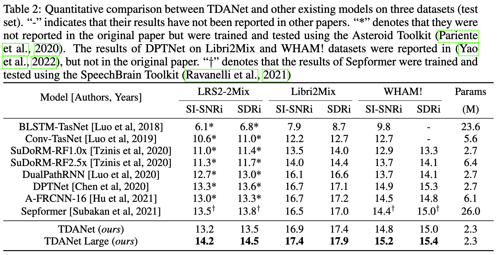

# An efficient encoder-decoder architecture with top-down attention for speech separation

[](https://paperswithcode.com/sota/speech-separation-on-libri2mix?p=an-efficient-encoder-decoder-architecture) [](https://paperswithcode.com/sota/speech-separation-on-wham?p=an-efficient-encoder-decoder-architecture)


This repository is the official implementation of [An efficient encoder-decoder architecture with top-down attention for speech separation](https://cslikai.cn/project/TDANet) [Paper link](https://openreview.net/pdf?id=fzberKYWKsI). 

```
@inproceedings{tdanet2023iclr,
  title={An efficient encoder-decoder architecture with top-down attention for speech separation},
  author={Li, Kai and Yang, Runxuan and Hu, Xiaolin},
  booktitle={ICLR},
  year={2023}
}
```

## News

:fire: October, 2023: We have released the pre-trained models of our TDANet. You can download them from [](https://huggingface.co/JusperLee/TDANetBest-2ms-LRS2) and [](https://huggingface.co/JusperLee/TDANetBest-4ms-LRS2).

:star2: July, 2023: We are pleased to announce the update of our model training framework! This new framework has excellent versatility, and it can flexibly handle the training and testing tasks of various voice separation models.


## Datasets

The [LRS2 dataset](https://www.robots.ox.ac.uk/~vgg/data/lip_reading/lrs2.html) contains thousands of video clips acquired through BBC. LRS2 contains a large amount of noise and reverberation interference, which is more challenging and closer to the actual environment than the WSJ0 and LibriSpeech corpora. 

**LRS2-2Mix** is created by using the LRS2 corpus, where the training set, validation set and test set contain 20000, 5000 and 3000 utterances, respectively. The two different speaker audios from different scenes with 16 kHz sample rate were randomly selected from the LRS2 corpus and were mixed with signal-to-noise ratios sampled between -5 dB and 5 dB. The length of mixture audios is 2 seconds.

Dataset Download Link: [Google Driver](https://drive.google.com/file/d/1dCWD5OIGcj43qTidmU18unoaqo_6QetW/view?usp=sharing)

## Training and evaluation

### Training

```shell
python DataPreProcess/process_librimix.py --in_dir=xxxx --out_dir=DataPreProcess/Libri2Mix
python audio_train.py --conf_dir=configs/tdanet.yml
```

### Evaluation

```shell
python audio_test.py --conf_dir=Experiments/checkpoint/TDANet/conf.yml
```

### Inference with Pretrained Model
```python
import os
import torch
import look2hear.models
import torchaudio

os.environ['CUDA_VISIBLE_DEVICES'] = "0"


mix, sr = torchaudio.load("audio_mix.wav")
transform = torchaudio.transforms.Resample(sr, 16_000)
mix = transform(mix)
mix = mix.view(1, 1, -1)
model = look2hear.models.BaseModel.from_pretrain("JusperLee/TDANetBest-2ms-LRS2").cuda()
est_sources = model(mix.cuda())
torchaudio.save("audio1sep.wav", est_sources[:, 0, :].detach().cpu(), 16_000)
torchaudio.save("audio2sep.wav", est_sources[:, 1, :].detach().cpu(), 16_000)
```

## Results

Our model achieves the following performance on :



## Demo Page

- [Demo](https://cslikai.cn/project/TDANet/)

## Reference

- [A-FRCNN](https://github.com/JusperLee/AFRCNN-For-Speech-Separation)
- [SudoRM-RF](https://github.com/etzinis/sudo_rm_rf)
- [Asteroid](https://github.com/asteroid-team/asteroid)
